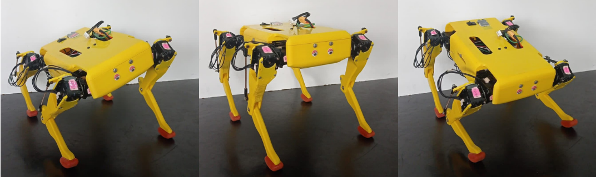
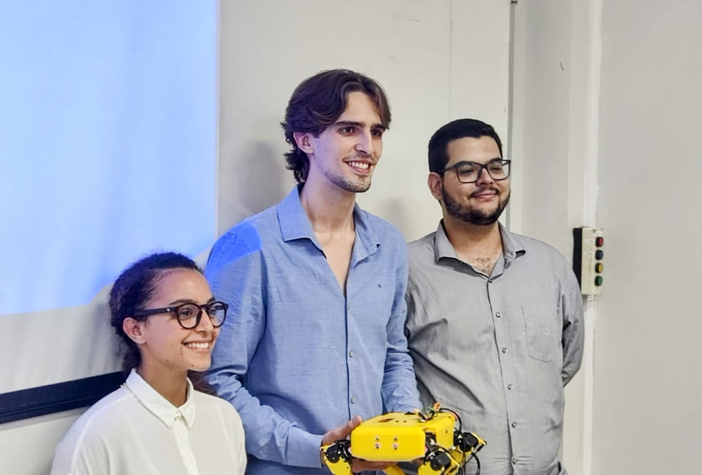

[](https://github.com/Brazilian-Institute-of-Robotics/bir-black-mouth/tree/devel)

# **Caramel**  :dog2:
Caramel is a project of an open-source quadruped robot for research, developed at the Centro Universitário SENAI CIMATEC in partnership with the Centro de Competência em Robótica e Sistemas Autônomos.

<p align="center">
    
</p>


## <span style="color: orange">**Features**</span>
- **ROS Platform**
   
    The robot Caramel is **ROS2** based, on Humble distribution. This project used resources like the Gazebo Simulator, ros2_control framework
- **Small Size**

    The dimension of Caramel is X X X , a little dog robot. 
- **Extensibility**

    There are possibilities for improvement, such as equipping it with sensors and implement new controllers.
- **Open Source**

    The software of Caramel is open source, all code is available to visitors

## <span style="color: orange">**Skills** </span>
The Caramel is teleoperated by a Joystick and has three operation modes, **Moving Body**, **Controlling Body** and **Walking**.

### Moving Body
In this mode you can move the robot's body in three directions and rotate it in three directions, keeping its feet on the ground.

    


### Controlling Body
The Caramel robot in this mode controls its body to keep itself stable, aligned on  x and y coordinates.

    

### Walking
In this mode you can move the Caramel along to x,y coordinates, increase and decrease step heigh and speed. 

    


# How to use Caramel :dog2:

The robot is configured to automatically connect to a network with the name *caramel* and password *caramel123*. So, you can change the network name and password on your router or use your mobile device's hotspot.

Make sure that your notebook or PC is connected to the same network, and to identify the address where Caramel's RaspberryPi is connected, you can run the command:

```bash
$ sudo nmap -sn $YOUR_IP_ADDRESS$/24
```

Then, connect your computer to the raspberry via SSH. The password is *caramel123*.

```bash
$ ssh ubuntu@$RASPBERRY_IP$
```

In you PC, run:
```bash
$ ros2 run joy joy_node --ros-args -p autorepeat_rate:=0.0
```

In the terminal connected to the Caramel Raspberry, run:
```bash
$ . /rsource.sh
$ ros2 launch caramel_bringup bringup.launch.py
```

You can specify the joystick you are using by including `joy_type=(ps4, x360 or generic)' in the line above.

# Instalation
## <span style="color: orange">**Packages contents** </span>
The Caramel packages are organized as follow:
- **caramel_bringup:** Package for starting the Caramel robot
- **caramel_control:** Contains the body control and hardware interface
- **caramel_data_analysis:** Package used only for data collection and analysis
- **caramel_description:** Caramel description, URDF and mesh files
- **caramel_gait_planner:** Contains gait trajectory planner and trot gait executor
- **caramel_gazebo:** Package for simulation in Gazebo
- **caramel_kinematics:** Contains quadruped's inverse kinematics
- **caramel_teleop:** Package teleoperation with a joystick 

## <span style="color: orange">**Install with Docker** </span>
#### Create workspace and build docker image
```bash
$ mkdir -p ~/workspaces/caramel_humble/src/
$ cd ~/workspaces/caramel_humble/src/
$ git clone git@github.com:Brazilian-Institute-of-Robotics/bir-black-mouth.git
$ cd bir-black-mouth
$ . build_docker.sh
```

#### Run docker container
```bash
$ . run_docker.sh
```

#### Inside docker container
```bash
$ source /rsource.sh
```

## <span style="color: orange">**Install without Docker** </span>
#### Create a workspace and clone the repository
```bash
$ mkdir -p ~/caramel_ws/src/
$ cd ~/caramel_ws/src/
$ git clone git@github.com:Brazilian-Institute-of-Robotics/bir-black-mouth.git
```

#### Build the packages
```bash
$ cd ~/caramel_ws/
$ colcon build
```

# Authors
This project was developed as a Course Completion Work of the Electrical Engineering course. To see the final paper, check [this repository](https://github.com/Brazilian-Institute-of-Robotics/bir-black-mouth-docs/tree/fix/spelling)

**Advisor:** MSc. Paulo Andrade Souza

**Co-advisor:** MSc. Marco Antonio dos Reis

**Authors:** Brenda Silva de Alencar, 
             Felipe Mohr Santos Muniz Barreto, 
             Lucas Lins Souza

<p align="center">
    
</p>
